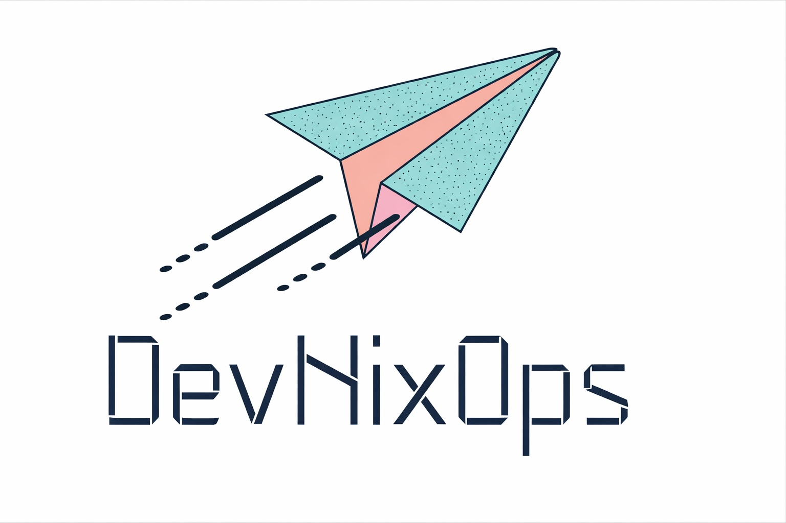

# DevOps Tools Directory

Welcome to the **DevOps Tools Directory** — a comprehensive and curated collection of DevOps tools spanning CI/CD, Cloud Platforms, Configuration Management, Security, Observability, Kubernetes ecosystems, and more. This site helps engineers, teams, and learners explore, compare, and find the right tools to incorporate into their DevOps workflow.

🔗 **Live Site:** https://devopstools.unixarena.com/  
📌 **Built with ❤️ by UnixArena**

---

## 🚀 About

The DevOps Tools Directory is a **centralized, easy-to-browse catalog** of popular DevOps tools — from container runtimes like Docker to automation platforms like Ansible, CI/CD platforms like GitHub Actions and Jenkins, secret management, monitoring solutions, and more. 

It is designed for:
- **DevOps Practitioners** looking for tool discovery
- **Learners & Students** exploring DevOps ecosystems
- **Teams** evaluating tools for automation, scaling, and observability

All tools are categorized and labelled with pricing models (Free / Free-Limited / Licensed) and primary DevOps categories.

---

## 📂 Tool Categories

The site organizes tools into the following broad categories:

- **CI/CD**
- **Cloud Platforms**
- **Container Orchestration**
- **Configuration Management**
- **Secrets Management**
- **Infrastructure as Code**
- **Monitoring & Observability**
- **Security & Compliance**
- **Kubernetes Tooling & Distributions**
- **Git Hosting & Workflow**
- **…and more**

---

## 🛠️ Built With

The site is powered by standard **HTML, CSS, and JavaScript** — designed for performance, SEO, and ease of browsing. Images and tool metadata are statically served and link directly to official repositories where available. 

---

## ⭐ Contributing

Contributions are welcome! Here are some ways you can help:

- **Add new DevOps tools** with accurate categories and links
- **Update existing listings** with latest versions, logos, or updated GitHub stars
- **Improve site UI/UX** by suggesting enhancements or layout refinements
- **Fix bugs or outdated content**

To contribute:
1. Fork the repository
2. Create your feature branch (`git checkout -b feature/foo`)
3. Commit your changes (`git commit -m 'Add new tool'`)
4. Push to branch (`git push origin feature/foo`)
5. Open a Pull Request

---

## 📌 License

This project is open-source and available under the **MIT License**.  
Feel free to use, modify, and distribute it as you see fit.

---

## 💬 Contact

If you have questions or want to suggest improvements, feel free to open an issue or contact the maintainer through the GitHub repository discussion area.

---

  

  <strong>DevNixOps</strong> — Learn • Build • Automate • Scale

Thank you for visiting — *Happy DevOps exploring!* 🚀
